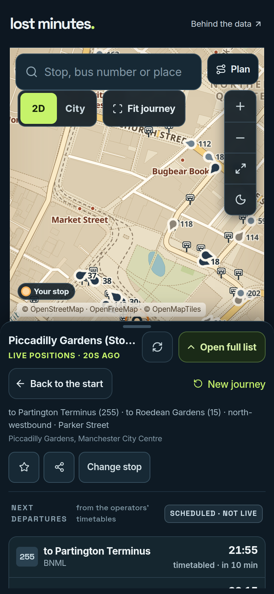
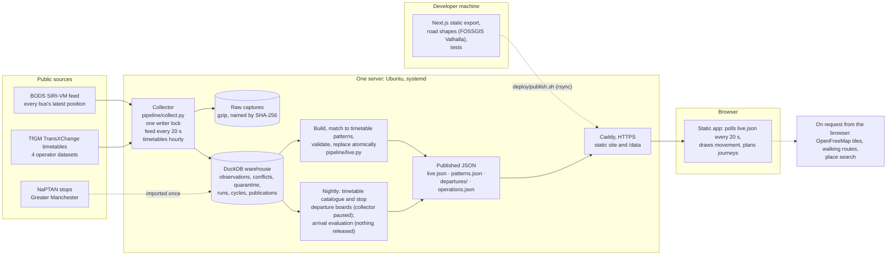

# Lost Minutes

Manchester bus tracking and timetable-based journey planning, backed by an auditable Python/DuckDB pipeline and an
interactive 3D map.

**Live: <https://lost-minutes.duckdns.org>**. It has been hosted on one server since 20 September 2026; uptime is not
measured. The interface has been tested in desktop and phone emulation, not yet on a phone in hand. Arrival
predictions were built, evaluated and are **switched off** (they did not meet criteria written before the results).



*The served site at 21:45 on 2 October 2026, real data, in phone emulation.*

## What it does

- **Find a stop** by name, bus number or place, or nearby. A stop shows its timetabled departures (labelled as the
  timetable) and the buses on its routes. The map draws buses using their position reports, with the report age and
  drawing status shown.
- **Follow one bus** on the map, drawn between its own reports, or ride along with it in 3D. On three evaluated routes
  a clearly labelled estimate may run up to two minutes past the last report; nothing is ever stored as a report.
- **Plan a journey**, direct or with one change, from the operators' registered timetables, and **make it a step at a
  time**: the walk to the stop (a walking route on request), the wait, the bus you board followed to the stop to get
  off at (said before it comes), and the walk on.
- **Behind the data**: the pipeline's runs, cycles and publications as it recorded them, the evidence behind the
  figures, and a replay of a recorded archive sample.

It does not predict arrival times, show live departure minutes, or cover Metrolink.

## How it works



The boundaries that matter: phones never contact BODS; only the collector writes to the warehouse; a published file
is replaced only after it validates; the browser reads static files and does its own drawing and planning. The
details are in [`docs/PIPELINE.md`](docs/PIPELINE.md) and [`PROJECT_CONTEXT.md`](PROJECT_CONTEXT.md).

Where to look in the code:
- `pipeline/collect.py`: the collector, its writer lock, per-cycle records and stage timings;
- `pipeline/core.py`: parsing, quarantine reasons and observation identity;
- `pipeline/warehouse.py`: the DuckDB schema and the repeat and conflict classification;
- `pipeline/live.py`: building, validating and atomically publishing the live state;
- `pipeline/match.py`: placing a bus on a timetable pattern, or refusing with a reason;
- `lib/motion.ts`: how a bus is drawn between its reports; `lib/connections.ts`: journey planning;
- `deploy/`: the systemd units, the health check, deploy and rollback.

## Engineering decisions worth reading

1. **One observation, defined.** Identity is (operator, vehicle, route, direction, journey, observation time). The
   same identity at a different place is a conflict: both readings are kept and neither is published. Every response
   is kept byte for byte, named by its SHA-256, and three clocks (observed, retrieved, published) are never merged.
   [Case study 1](docs/case-studies/01-ingestion-identity-and-recovery.md).
2. **Refuse rather than guess.** A bus is placed on a timetable pattern only when operator, timetable version,
   operating day and direction agree; two equally good branches stay unresolved. Positions over 15 minutes old are
   withheld and counted. Conflicts are withheld, not resolved.
3. **Measure before optimising.** The collector times each stage in its own log. Over 72 cycles on 2 October, two
   queries that read the whole history had per-cycle medians of 20.0 s and 7.5 s, and the median time from receiving
   the feed to writing the file was 32.0 s. With both bounded to the window they need, that median was 4.8 s over the
   next 131 cycles: consecutive live windows, not a same-input benchmark.
   [Case study 2](docs/case-studies/02-latency-investigation.md).
4. **Evaluate before releasing, and accept a no.** Release criteria for an arrival estimate were fixed before any
   held-out result was read, and the current evaluation (protocol `display-1`) is frozen and pinned to its code by
   hash. On its revision days (21–26 September, route 15) it fails them; its confirmation days (29 September–
   5 October) are read once, after 6 October. Predictions are off by the owner's decision.
   [Case study 3](docs/case-studies/03-arrival-evaluation.md).
5. **Reproduce production failures before fixing them.** A swallowed stop signal, an out-of-memory kill, a timetable
   that was an error page. [Case study 4](docs/case-studies/04-operational-failures.md).

## Measurements

| What | Value | Basis |
|---|---|---|
| Stored live observations | 12.8 million | the warehouse, about 17:45 UTC, 2 Oct 2026 |
| Vehicle activity records inside the area, per feed response | 630–658 | 203 responses, 17:54–19:17 UTC, 2 Oct 2026; a count per response, not buses in service |
| Receipt to the file being written, per cycle (median) | 32.0 s → **4.8 s** | 72 and 131 cycles, consecutive live windows on 2 Oct 2026, before and after one change; not a same-input benchmark |
| A report's age on reaching an emulated phone (median) | 51.9 s → 19.2 s and 22.6 s | one emulated phone, 20 minutes a run, same day |
| Timetable coverage | 4 datasets, 206 observed services, 585 patterns; 133 observed services with no timetable held | the server's nightly build, 02:43 UTC, 2 Oct 2026 |

Every figure, with its metric, window and sample, is in [`docs/EVIDENCE.md`](docs/EVIDENCE.md).

## Guarantees, and their limits

- **One writer.** An exclusive advisory file lock: a second collector refuses to start (it does not stop other
  programs). This is one process on one machine, not distributed or exactly-once processing: loading is idempotent
  (the same bytes add no rows).
- **Atomic replacement of one file.** Each published file is written aside and renamed into place only after it
  validates, so a reader never sees a half-written file. The live file is not `fsync`ed, so the newest write may not
  survive a power cut. Files are replaced independently, and a deploy (rsync) is not atomic.
- **Recovery.** A stopped run records why; a killed run is closed as abandoned by the next one; the warehouse can be
  rebuilt from the captures (`pipeline/restore.py`). There is no off-server backup and no external alerting.
- **Coverage.** Buses whose operator timetable is not held are shown at their reports but not placed on a route.
- **Planning** uses registered timetables; a timetable not checked against real buses is said to be unchecked.
- **Arrival predictions are disabled** in both directions.

## Run it locally

Credential-free (the map, stops, timetables, a recorded ride and the archive replay; no live buses):

```bash
pnpm install --frozen-lockfile
pnpm build && pnpm start        # http://localhost:3000
```

Live collection needs a free BODS key, Python 3.11+ and a few minutes of first-run downloads. Both paths, with
prerequisites and the external services each one contacts, are in [`docs/SETUP.md`](docs/SETUP.md).

## Tests

- **Python** (the pipeline, matching, the arrival protocol, restore): 191 tests, 190 passed, 1 skipped (it needs the
  downloaded archive sample), 0 failed. **Node** (contracts, drawing, planning, navigation): 349 tests, 346 passed,
  3 skipped, 0 failed. Both in CI on `fead20d` (2 Oct 2026), which runs them on every push with type checking, lint,
  the static build, a scan of the built site for credential values, and a check of the systemd units that fails on
  an unknown directive.
- **Browser**: 534 checks in Chromium with software WebGL, desktop and phone emulation, about 1.4 hours locally; on
  `11eebf5` (2 Oct 2026) 483 passed, 51 skipped by design, 0 failed. Not in CI: it depends on external map tiles.

```bash
pnpm test && pnpm typecheck && pnpm lint
.venv/bin/python -m unittest discover -s tests
scripts/setup-browser.sh && pnpm build && pnpm test:browser
```

## Limitations

- Tested in emulation only; nothing has been checked on a phone in hand.
- A report reached an emulated phone 19.2 s and 22.6 s old at the median (two 20-minute runs, 2 Oct 2026). Measured
  separately: a report was 10.4 s old at the median when the feed answered; our receipt-to-written median was 4.8 s;
  and the page asks every 20 s.
- A bus's progress is counted in stops from its nearest pattern stop, with no measured error bound.
- One server, one disk; uptime is not measured.
- The 3D "front view" is a stylised map drawing, not imagery.

## At a larger scale

*Proposals written on 2 October 2026; none of this is built or tested.* Each keeps the guarantees above.
- **Storage.** A single DuckDB file with one writer suits one city on one machine. For many feeds: raw captures in
  object storage, still named by SHA-256, and observations in append-only columnar files partitioned by observation
  date.
  - **Identity** stays the same six fields. A load deduplicates against the partitions its payload's times fall in,
    instead of against the whole history; that is also the fix for today's load (3.4 s at the median, growing).
  - **Conflicts** stay a separate table, found the same way: one identity, different coordinates. Conflicting
    identities stay excluded from anything published.
- **Writers.** One collector per region, each holding a lease, would keep one writer per partition. Re-delivering the
  same bytes would still add nothing.
- **Publication.** Each region's file is built and validated as now, then written as a new versioned object. Readers
  switch to it through a small pointer file replaced atomically, so they never see a half-written publication, and
  the previous version stays available to roll back to.
- **Delivery and operations.** A CDN with a short cache in front of the published objects, and polls timed to just
  after the next expected write. The stage timings exported as metrics with alerts.

## How this was built

Hammam Elshtewi owns and directs this project. He sets its goals and scope, chose its hosting, and sets the rules
under which changes are deployed; he approved, for example, the planned collector restarts that measured its latency.
He makes the product and release decisions recorded in these documents, among them keeping arrival predictions off,
and reports the problems he finds using it on his own phone. Most of the code, tests and documentation were written with an AI
coding assistant (Anthropic's Claude, through Claude Code), working under the project's written rules
([`AGENTS.md`](AGENTS.md), [`CLAUDE.md`](CLAUDE.md)). The application itself contains no AI features.

## Documentation

[`docs/README.md`](docs/README.md) is the index: start there for the case studies, the evidence page, the release
record and the design notes; superseded material is labelled as historical.

## Data and licences

- Bus positions and timetables: Department for Transport and contributing operators, via the Bus Open Data Service;
  stops: NaPTAN. Open Government Licence v3.0. The recorded archive sample: Open Innovations / National Data Library
  BODS archive, OGL v3.0.
- Map tiles: OpenFreeMap, © OpenMapTiles, © OpenStreetMap contributors (ODbL). Road shapes for bus routes: generated
  from OpenStreetMap data by the FOSSGIS Valhalla service (ODbL). Walking routes: FOSSGIS e.V.'s OSRM foot profile on
  routing.openstreetmap.de, asked for only when the passenger chooses. Place search: Photon (komoot), © OpenStreetMap
  contributors, and postcodes.io.
- Bundled software: MapLibre GL JS (BSD-3-Clause), CesiumJS (Apache-2.0, private preview only), Inter and Space Grotesk
  (SIL Open Font Licence, `public/fonts/LICENCES.txt`), shadcn/ui styles (MIT, `vendor/`).
- Code: MIT, © 2026 Hammam Elshtewi ([`LICENSE`](LICENSE)).
